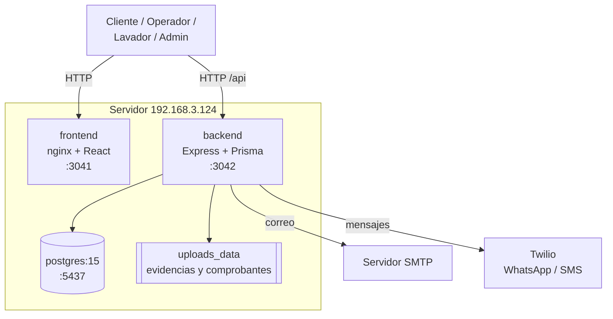
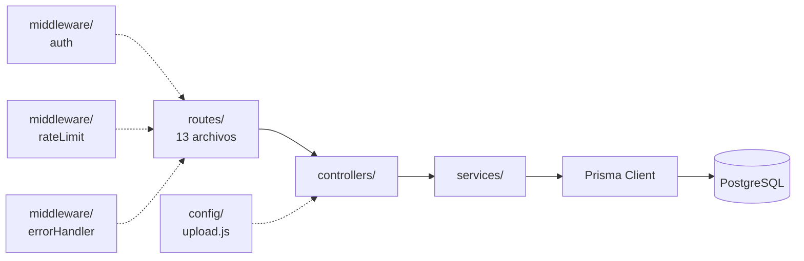
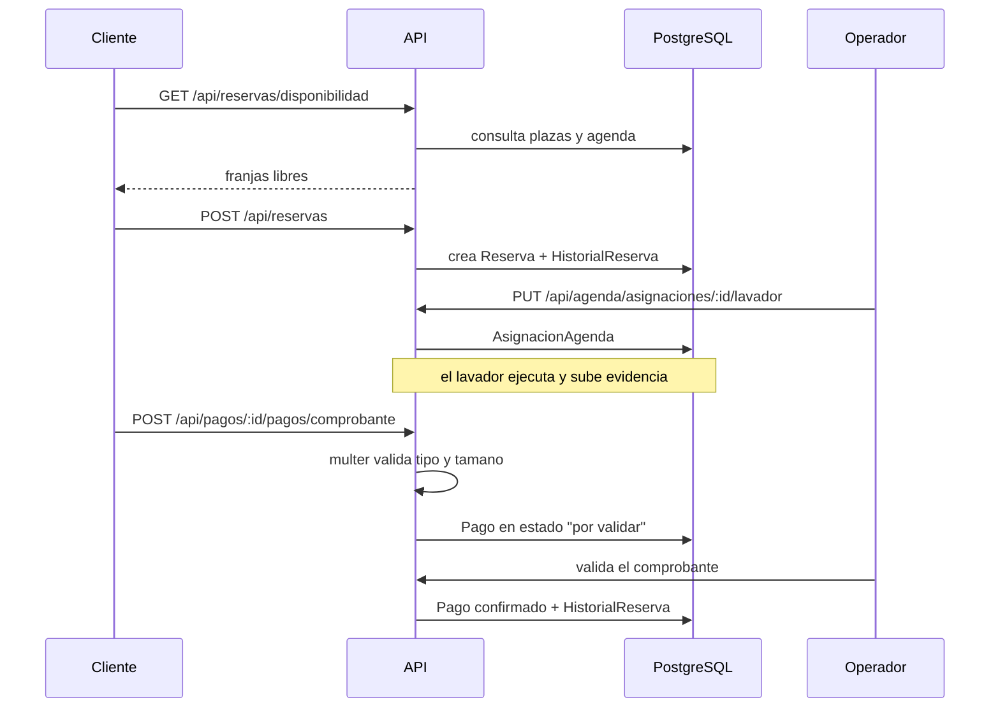

# Arquitectura

## Resumen

Tres contenedores: **frontend React servido por nginx**, **API Express** y
**PostgreSQL**. Sin cache ni colas. Integraciones externas de correo (SMTP) y
mensajeria (Twilio WhatsApp y SMS).

| Capa | Tecnologia | Version | Fuente |
|---|---|---|---|
| Frontend | React + TypeScript + Tailwind | React 19.2.4, TS 4.9.5 | `frontend/package.json` |
| Servidor web | nginx (imagen del build del frontend) | — | `frontend/Dockerfile`, `frontend/nginx.conf` |
| Backend | Node.js + Express | Express 4.18.2 | `backend/package.json` |
| ORM | Prisma | 5.10.0 | `backend/package.json` |
| Base de datos | PostgreSQL | **15.18** (verificado en ejecucion) | `SELECT version()` |
| Autenticacion | JWT (`jsonwebtoken`) + `bcryptjs` | 9.0.2 / 2.4.3 | `backend/package.json` |
| Subida de archivos | multer | 1.4.5-lts.1 | `backend/package.json` |
| Documentacion API | Swagger UI | — | `backend/src/index.js` |
| Correo | SMTP | — | variables `SMTP_*` |
| Mensajeria | Twilio (WhatsApp + SMS) | — | variables `TWILIO_*` |

## Diagrama de arquitectura

**Nota:** el puerto 3042 del backend **esta publicado directamente**, asi que
el navegador puede llamarlo sin pasar por el frontend. El propio codigo lo
reconoce: el comentario de `rateLimit.middleware.js` dice *"la API vive detras
de nginx y ademas publica el puerto 3042, asi que la IP se puede falsear"*.

## Diagrama de componentes del backend

Separacion en capas correcta: rutas → controladores → servicios → Prisma, con
middleware transversal.

## Flujo de datos: reserva y pago con comprobante

## Decisiones de diseno observadas

**La autenticacion revalida contra la base de datos en cada peticion.** El
comentario del propio codigo lo explica: *"El token dura 24h, asi que sin esta
consulta un usuario suspendido seguiria operando hasta un dia entero"*. Es una
decision correcta y poco comun; tiene un costo de una consulta por peticion.

**El rate limiting se aplica por id de usuario, no por IP.** Razon documentada
en el codigo: la IP se puede falsear con `X-Forwarded-For` en una llamada
directa al 3042. El login se limita por nombre de usuario.

**El store del rate limiting es en memoria.** El propio codigo advierte que
alcanza para una sola instancia y que con varias replicas haria falta Redis.

**Sin cache ni colas.** Los envios de correo y Twilio son sincronicos dentro de
la peticion: `NO DETERMINADO` si hay reintentos, no se verifico en detalle.

## Componentes que NO existen

Verificado: no hay Redis, ni worker, ni cola, ni cron, ni websockets, ni
aplicacion movil, ni reverse proxy propio del proyecto (el nginx que hay sirve
solo los estaticos del frontend).
