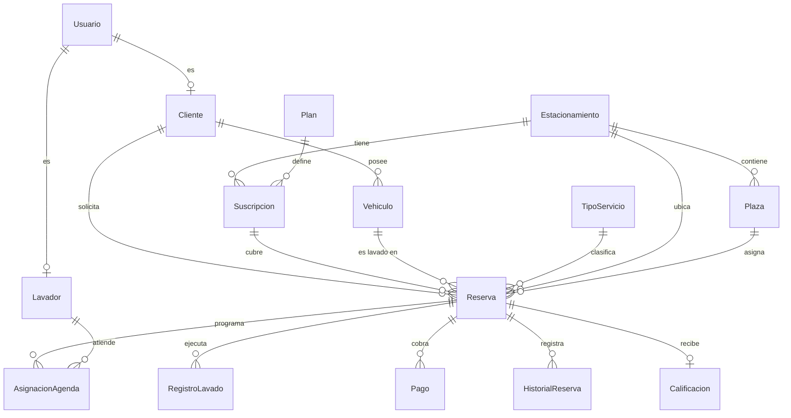

# Modelo de datos

| | |
|---|---|
| Motor | **PostgreSQL 15.18** (verificado con `SELECT version()`) |
| Imagen | `postgres:15-alpine` |
| ORM | Prisma 5.10.0 |
| Esquema | `public` |
| Entidades | 15 |
| Puerto publicado | 5437 — **ver SEC-01** |
| Migraciones | gestionadas por Prisma (tabla `_prisma_migrations`) |

Definicion completa en `backend/prisma/schema.prisma` (280 lineas).

## Diagrama entidad-relacion

**`Reserva` es la entidad central**: seis relaciones entrantes y cinco
salientes. Todo el modelo gira alrededor de ella.

> **Nota:** no se genera `Diagrama_ER.png` como imagen. El diagrama Mermaid de
> arriba se renderiza en GitHub, en VS Code y en la exportacion a PDF, y tiene
> la ventaja de actualizarse editando texto. Si se requiere el PNG, se obtiene
> con `npx prisma generate` y un generador de ERD, o exportando este diagrama.

## Entidades

| Entidad | Para que | Filas reales |
|---|---|---|
| `Usuario` | credenciales y rol | 11 |
| `Cliente` | ficha del cliente | 6 |
| `Vehiculo` | vehiculos del cliente | 8 |
| `Estacionamiento` | sitio donde se presta el servicio | 5 |
| `Plaza` | plaza concreta dentro del estacionamiento | 42 |
| `Plan` | plan de suscripcion | 1 |
| `Suscripcion` | suscripcion activa de un estacionamiento | 1 |
| `TipoServicio` | catalogo de servicios | 6 |
| `Lavador` | ficha del operario | 3 |
| `Reserva` | **entidad central** | 18 |
| `AsignacionAgenda` | que lavador atiende que reserva | 20 |
| `RegistroLavado` | ejecucion y evidencia | 4 |
| `Pago` | cobros y comprobantes | 5 |
| `HistorialReserva` | bitacora de cambios de estado | 31 |
| `Calificacion` | valoracion del cliente | 3 |

Conteos exactos con `count(*)` al 2026-09-15.

> **Advertencia metodologica:** no usar `pg_stat_user_tables.n_live_tup` para
> contar filas de este sistema. Durante esta auditoria esa vista reportaba
> valores muy distintos (por ejemplo `TipoServicio` = 0 cuando en realidad hay
> 6), porque son estimaciones que dependen del ultimo `ANALYZE`. Confiar en
> ellas habria producido un hallazgo falso de integridad referencial.

## Integridad referencial

Las claves foraneas de `Reserva`, verificadas en la base:

| Restriccion | Al borrar el padre |
|---|---|
| `Reserva_id_cliente_fkey` | **RESTRICT** — no se puede borrar un cliente con reservas |
| `Reserva_id_vehiculo_fkey` | **RESTRICT** |
| `Reserva_id_tipo_servicio_fkey` | **RESTRICT** |
| `Reserva_id_estacionamiento_fkey` | SET NULL |
| `Reserva_id_plaza_fkey` | SET NULL |
| `Reserva_id_suscripcion_fkey` | SET NULL |

Criterio coherente: lo que identifica la reserva (cliente, vehiculo, servicio)
se protege con `RESTRICT`; lo que es ubicacion o cobertura se puede desvincular
con `SET NULL` sin destruir el historico.

## Campos de rol

`Usuario.rol` es `String` con valor por defecto `"cliente"`. **No es un enum**:
los valores validos (`admin`, `operador`, `lavador`, `cliente`) estan
unicamente en un comentario del schema. Ver SEC-07.

Distribucion real: `cliente` 6, `lavador` 3, `admin` 1, `operador` 1.

## Migraciones y seeds

- Migraciones: Prisma (`npm run db:push`, `db:generate` en `package.json`).
- Seed: existe `npm run db:seed`. El commit `9837353` menciona *"Seed de demo:
  restaurar contrasenas y dejar comprobantes por validar"*, lo que confirma que
  **los datos actuales son de demostracion**.

## Procedimientos, triggers y vistas

**Ninguno.** Toda la logica esta en la capa de aplicacion.
