# Manual de usuario — Total Clean Car

Versión 2.0 · 2026-09-27 · Reemplaza a la versión 1.0 (2026-09-15, "LavadoCarros")

Versión editable en línea: [Manual de usuario — Total Clean Car](https://claude.ai/code/artifact/c6c322fc-329a-4220-afd0-37126360a06f).
Este archivo es la copia versionada para auditoría. Los cambios se registran en
`docs/14_GESTION/Historial_Versiones.md`.

## 1. Introducción

Total Clean Car permite reservar el lavado de un vehículo en su estacionamiento o en
la bahía del taller, y coordina a quienes lo hacen. Cada persona entra con su
usuario y ve solo las pantallas de su rol.

| Rol | Qué hace | Dónde entra al iniciar sesión |
| --- | --- | --- |
| Cliente | Reserva lavados, paga, sigue el estado y califica | Mis Reservas |
| Lavador | Ve sus trabajos del día, sube fotos y marca el avance | Mis Trabajos |
| Operador | Confirma reservas, asigna lavadores y valida pagos | Dashboard (en el celular, Agenda) |
| Administrador | Todo lo del operador, más el catálogo, los precios y la configuración | Dashboard (en el celular, Agenda) |

Hay dos modalidades de servicio:

- **Expreso:** el lavador va al estacionamiento del cliente (edificio, condominio o empresa).
- **Limpieza profunda:** el cliente lleva el vehículo a una bahía del taller.

Se puede usar de dos formas, con el mismo usuario y los mismos datos:

- **Web:** desde el navegador del computador o del celular.
- **App Android:** instalando la app Total Clean Car (ver sección 2.1).

El precio y la duración de cada servicio dependen del **tipo de vehículo**: moto,
liviano, SUV o camioneta. Por eso lo primero al reservar es elegir el vehículo.

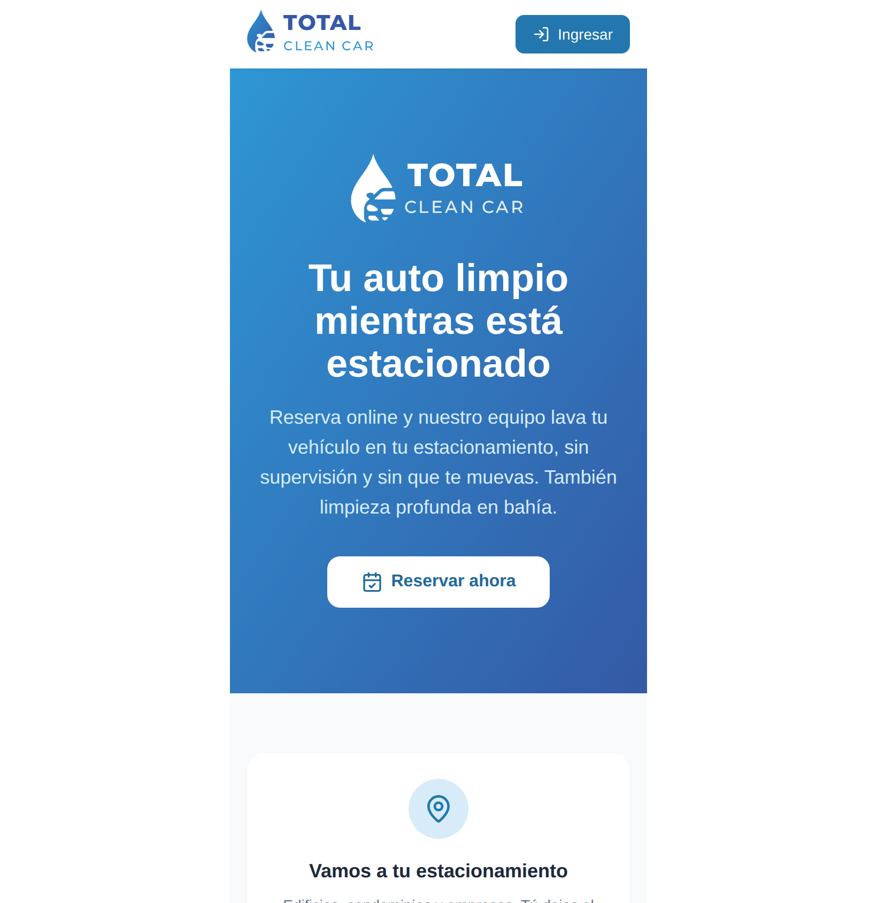

**Figura 1 — Portada.** Presenta el servicio y el catálogo con el precio por tipo
de vehículo. **Reservar ahora** inicia una reserva; **Ingresar**, arriba a la
derecha, abre el inicio de sesión (con la sesión abierta dice **Mi cuenta**).

## 2. Primeros pasos

Para usar Total Clean Car basta con una cuenta: el cliente la crea solo al hacer su
primera reserva, y el personal recibe la suya del administrador.

### 2.1 Instalar la app Android

1. Reciba el archivo `TotalCleanCar.apk` por el canal que le indique la empresa (correo, WhatsApp o Drive).
2. Ábralo en el teléfono. Si Android lo pide, permita **Instalar apps de origen desconocido** para esa aplicación (correo, navegador o gestor de archivos).
3. Toque **Instalar** y luego **Abrir**. Aparece el ícono de la gota azul con el auto.

La versión actual todavía no está en Google Play; se instala así, a mano.

### 2.2 Crear una cuenta (clientes)

1. En la portada toque **Reservar ahora**.
2. En el primer paso complete nombre, correo, teléfono (opcional) y una contraseña.
3. Toque **Crear cuenta y continuar**. Queda con la sesión iniciada y sigue con la reserva.

El correo es su usuario. Operadores y lavadores no crean cuenta: el administrador se la entrega.

### 2.3 Iniciar sesión

1. Toque **Ingresar** (arriba a la derecha de la portada).
2. Escriba su usuario o correo y su contraseña, y toque **Ingresar**.
3. La app lo lleva a su pantalla de inicio según su rol.

La sesión queda abierta aunque cierre la app o vuelva atrás. Dura 24 horas;
después hay que ingresar de nuevo.

**Figura 2 — Inicio de sesión.** Acepta usuario o correo y contraseña.

### 2.4 Cerrar sesión

Abra el menú (☰ en el celular) y toque el ícono de salida junto a su nombre, abajo
a la izquierda.

### 2.5 Olvidé mi contraseña

Pídale al administrador que la restablezca. Recibirá una contraseña temporal para entrar.

## 3. Cliente: reservar un lavado

Una reserva se arma en seis pasos, como comprar una entrada de cine. La barra de
abajo muestra siempre el total y la duración acumulados; **Siguiente** avanza y el
botón atrás (de la pantalla o del teléfono) vuelve al paso anterior sin perder lo elegido.

1. **Vehículo.** Elija el vehículo que se va a lavar o toque **Registrar otro vehículo**. Al registrarlo, el **tipo** es obligatorio (moto, liviano, SUV o camioneta) y la placa también; marca, modelo y color son opcionales. Si un vehículo antiguo aparece sin tipo, elija el tipo ahí mismo.
2. **Servicio.** Se muestran los servicios con el precio y la duración para ese tipo de vehículo. Los que no se ofrecen para ese tipo aparecen apagados con la nota "No disponible para …".
3. **Adicionales.** Opcional. Marque los extras que quiera (por ejemplo, un encerado); cada uno suma su precio y sus minutos. Si no quiere ninguno, toque **Omitir**.
4. **Lugar.** Para un servicio expreso, elija el estacionamiento donde está el vehículo. La limpieza profunda se hace en la bahía del taller y no pide lugar.
5. **Función (día y hora).** Elija el día en la tira de fechas (hasta dos semanas) y luego la hora. Cada horario muestra los cupos que quedan; los agotados aparecen tachados y los de hoy que ya pasaron no se muestran.
6. **Boleto.** Revise el resumen: vehículo, lugar, servicio, adicionales y total. Toque **Confirmar reserva**.

| | |
|---|---|
| 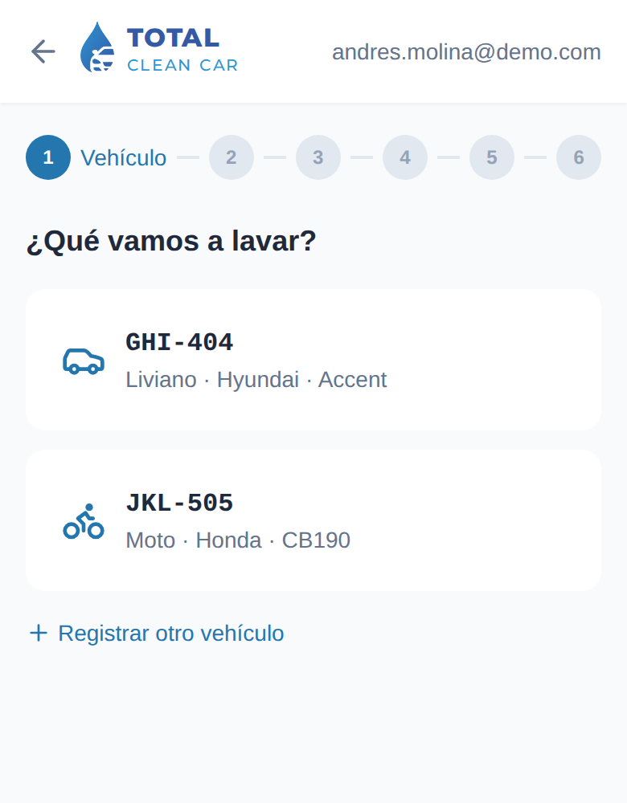 | 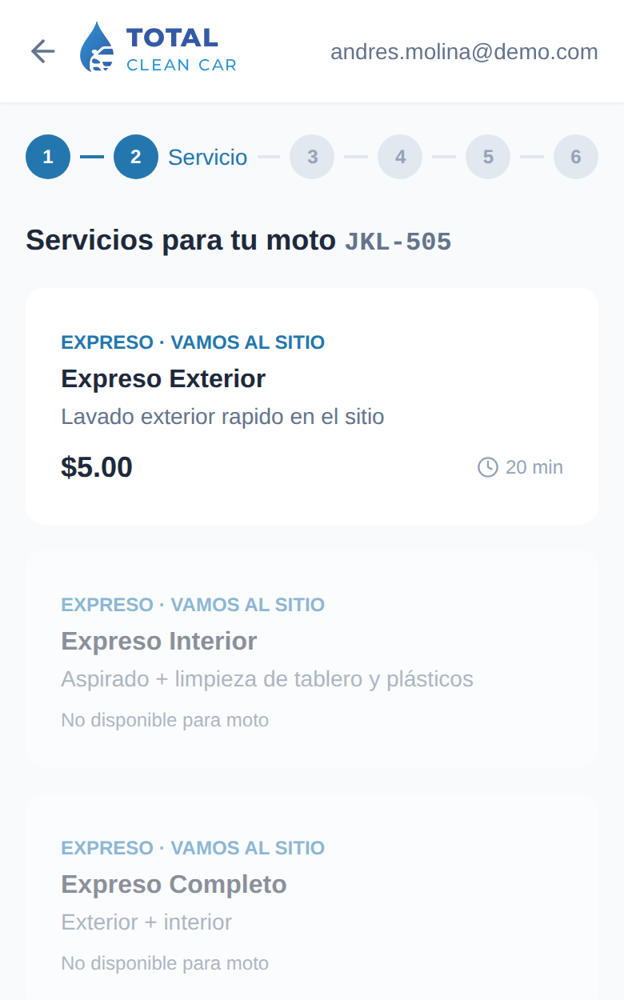 |
| **Figura 3 — Paso 1, vehículo.** | **Figura 4 — Paso 2, servicios para una moto.** Solo uno se ofrece para ese tipo. |
| 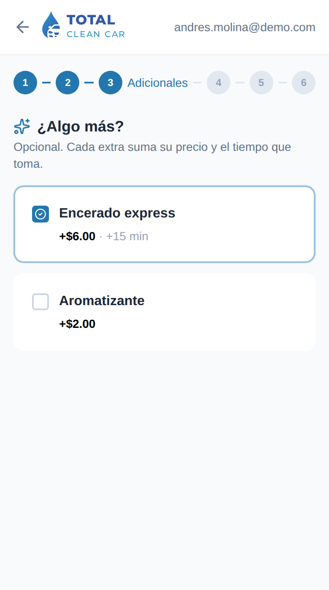 | 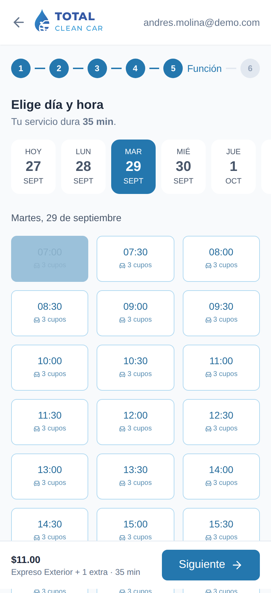 |
| **Figura 5 — Paso 3, adicionales.** | **Figura 6 — Paso 5, día y hora con los cupos disponibles.** |

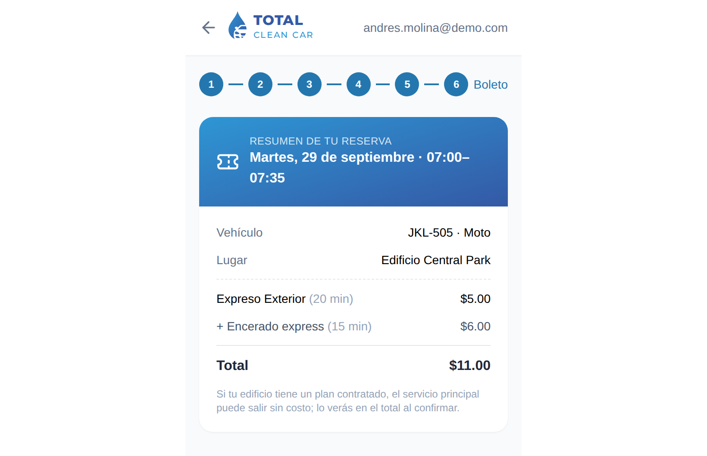

**Figura 7 — Paso 6, boleto.** Resumen con el precio del servicio, cada adicional y el total.

Al confirmar aparece el boleto con el **código de reserva** (por ejemplo
`RES-2026-00034`) y llega un correo de recepción. La reserva queda **solicitada**
hasta que el operador la confirma.

**Si su edificio tiene un plan contratado**, el servicio principal puede salir sin
costo; los adicionales se cobran siempre. El total final se ve al confirmar.

**Si al confirmar aparece "Franja no disponible"**, otra persona tomó el último
cupo en ese momento: vuelva al paso 5 y elija otra hora.

## 4. Cliente: seguir, pagar y calificar

Todas sus reservas están en **Mis Reservas**, cada una con su código, servicio,
adicionales, vehículo, fecha, hora, lugar y total.

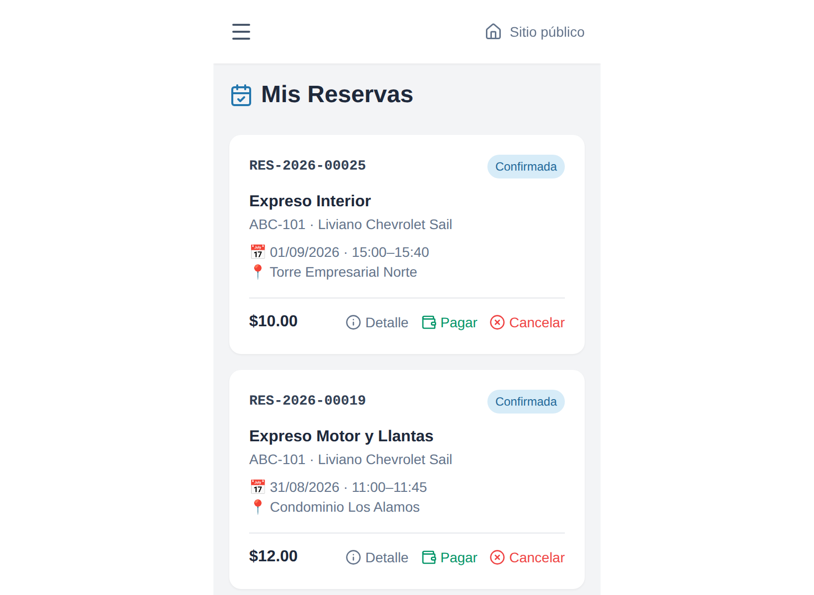

**Figura 8 — Mis Reservas.** Cada tarjeta ofrece las acciones que corresponden a su estado.

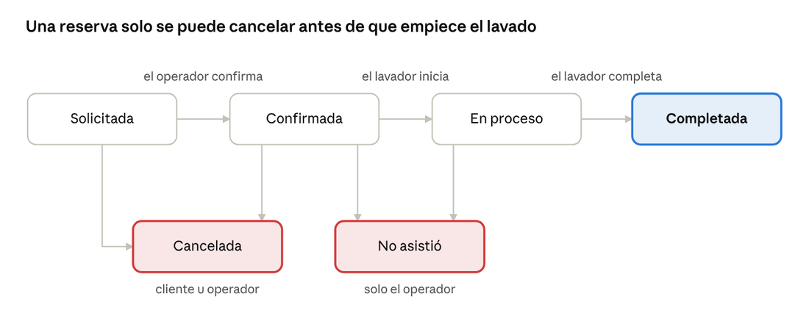

**Figura 9 — Estados de una reserva.** Una reserva solo se puede cancelar antes de que empiece el lavado.

Cada cambio de estado queda en el **Historial** de la reserva (botón **Detalle**),
y llega un correo cuando se confirma y cuando se completa. Si la empresa activó los
mensajes, el día anterior también llega un recordatorio por WhatsApp o SMS al
teléfono registrado.

### 4.1 Pagar por transferencia

1. Transfiera el total a la cuenta que le indique la empresa.
2. En la reserva toque **Pagar** y adjunte el comprobante, el monto y, si lo tiene, el número de transferencia.
3. Toque **Enviar comprobante**. La tarjeta muestra "en verificación" hasta que el operador lo aprueba.

El comprobante es **un solo archivo** de hasta **5 MB**: imagen (JPG, PNG, WEBP o
GIF) o PDF. Si el operador no puede validarlo, la reserva avisa que el comprobante
fue rechazado y puede enviar otro. También se puede pagar en efectivo al lavador;
el operador lo registra.

El pago con tarjeta todavía no está disponible: la pasarela de pagos no está conectada.

### 4.2 Cancelar

Toque **Cancelar** en la reserva y confirme. Solo se puede mientras está
solicitada o confirmada; una vez iniciado el lavado ya no.

### 4.3 Ver la evidencia y descargar el acta

- **Evidencia:** fotos de antes y después que subió el lavador.
- **Acta:** PDF con los datos del servicio, las fotos, los pagos y la calificación. En la app Android se abre el menú de compartir para guardarla o enviarla.

### 4.4 Calificar

Cuando el lavado está completado aparece **Calificar**. Elija de 1 a 5 estrellas
y, si quiere, deje un comentario. Cada reserva se califica una sola vez.

## 5. Lavador: mis trabajos

El lavador ve en **Mis Trabajos** solo las reservas que el operador le asignó, con
el servicio, los adicionales que debe hacer, el vehículo (placa, tipo, marca y
modelo), la hora y el lugar. Arriba puede cambiar la fecha para ver otro día.

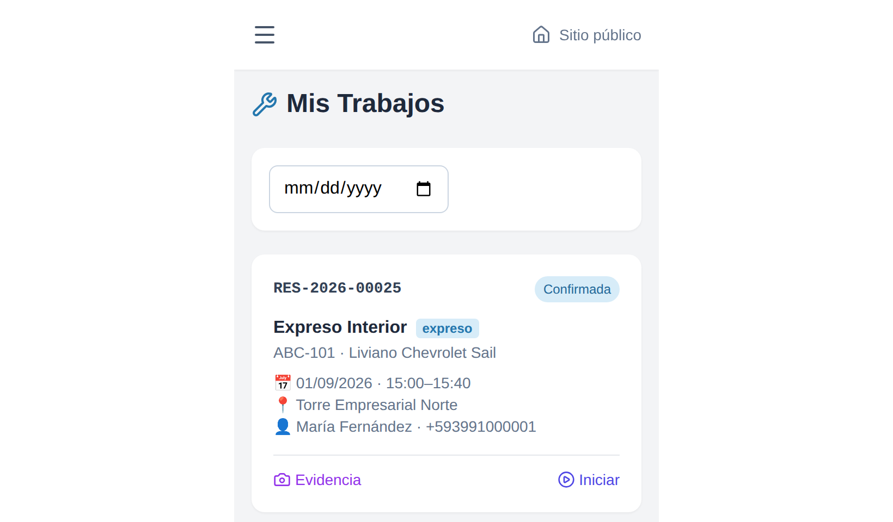

**Figura 10 — Mis Trabajos.** Tarjeta de un trabajo confirmado, lista para iniciar.

**Revise siempre los adicionales:** aparecen en azul debajo del servicio (por
ejemplo "+ Encerado express") y son parte del trabajo que el cliente pagó.

Con cada trabajo:

1. Al llegar, abra **Evidencia** y suba las fotos de **antes**. En el celular puede tomarlas con la cámara o elegirlas de la galería. Se admiten hasta 6 imágenes (JPG, PNG, WEBP o GIF) de 5 MB por vez.
2. Toque **Iniciar**. La reserva pasa a "en proceso" y el cliente lo ve.
3. Al terminar, suba las fotos de **después**.
4. Escriba en la descripción lo que hizo o lo que observó (una mancha que no salió, un rayado previo) y toque **Guardar descripción**. Esa nota sale en el acta que recibe el cliente.
5. Toque **Completar**. El cliente recibe el aviso y puede calificar.

**Iniciar** solo aparece cuando la reserva está confirmada, y **Completar** cuando
está en proceso. Si un trabajo no aparece o el cliente no está, avise al operador:
él reasigna el trabajo o cancela la reserva.

El lavador también puede ver la **Agenda** del día para saber qué más está programado.

## 6. Operador y administrador: el día a día

El trabajo diario es confirmar cada reserva nueva, asignarle un lavador y validar
los pagos. Todo se hace desde el menú de la izquierda (☰ en el celular).

### 6.1 Dashboard

Resumen del negocio: lavados de hoy, la semana y el mes, ingresos del mes,
ocupación de hoy, calificación promedio y solicitudes pendientes de confirmar.

### 6.2 Agenda

Muestra todo lo ocupado en un día y la capacidad (lavados expreso simultáneos y
bahías de limpieza profunda). Para cerrar un horario por mantenimiento o un
imprevisto, use **Bloquear franja manualmente**: indique inicio, fin y motivo, y
toque **Bloquear**. Ese horario deja de ofrecerse a los clientes en todos los sitios.

### 6.3 Reservas

Lista filtrable por fecha, estado y modalidad. Cada fila muestra servicio,
adicionales, cliente, placa y tipo de vehículo, horario, lavador y estado de pago.

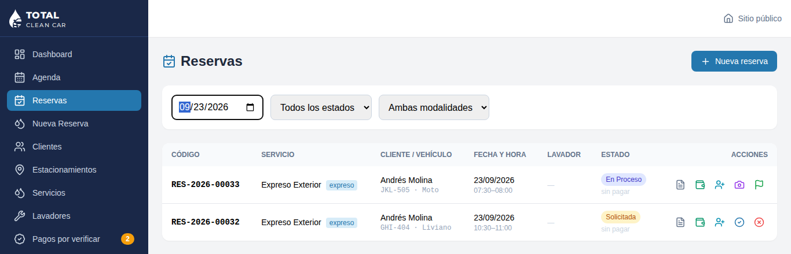

**Figura 11 — Reservas.** Los botones de acción de cada fila, a la derecha.

| Botón | Qué hace | Cuándo aparece |
| --- | --- | --- |
| Confirmar | Acepta la reserva y avisa al cliente | Solicitada |
| Asignar lavador | Elige quién la hace; rechaza si ese lavador ya tiene otro trabajo a la misma hora | Solicitada, confirmada o en proceso |
| Iniciar / Completar | Lo mismo que hace el lavador, por si no tiene el celular a mano | Confirmada / en proceso |
| Cancelar | Cancela y libera el horario | Solicitada o confirmada |
| Pagos | Registra un pago en efectivo o transferencia, con comprobante, o aprueba uno enviado | Salvo en canceladas |
| Evidencia | Ve o sube fotos y la descripción del trabajo | En proceso o completada |
| Acta | Descarga el PDF del servicio | Siempre |

El estado "No asistió" existe, pero el panel todavía no tiene un botón para
marcarlo: si el cliente no está, cancele la reserva.

### 6.4 Nueva reserva para un cliente

Para quien llama por teléfono o llega sin reserva: en **Reservas** toque **Nueva reserva**.

1. Busque al cliente por nombre, correo o cédula. Si no existe, regístrelo primero en **Clientes**.
2. Elija su vehículo o registre uno nuevo, con su tipo. Si el vehículo no tiene tipo, el formulario lo pide.
3. Elija el servicio (cada uno muestra el precio para ese tipo de vehículo), los adicionales, el estacionamiento y la fecha.
4. Toque un horario libre y **Registrar reserva**. Se muestra el código y el total.

### 6.5 Pagos por verificar

Aquí llegan los comprobantes que envían los clientes; el menú muestra cuántos hay
pendientes. Revise la imagen o el PDF contra la cuenta bancaria y toque **Aprobar
pago** o **Rechazar** (con el motivo). Un comprobante no cuenta como ingreso hasta
que se aprueba.

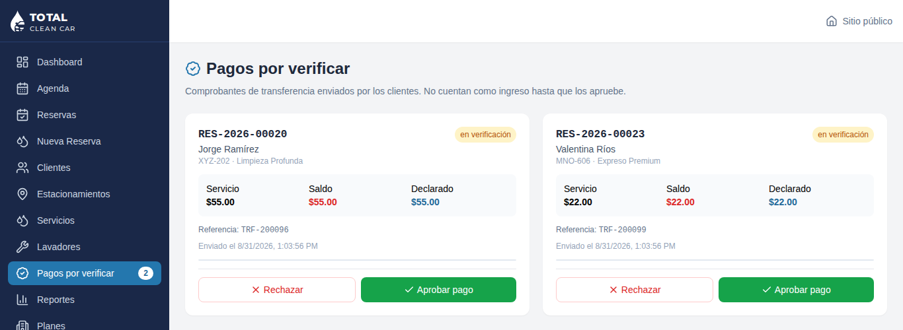

**Figura 12 — Pagos por verificar.**

## 7. Administrador: catálogo y configuración

Lo que se ofrece y cuánto cuesta se define en **Servicios**; quién y dónde se
trabaja, en Clientes, Lavadores y Estacionamientos. Nada se borra: se
**desactiva**, y así las reservas y los reportes anteriores quedan intactos.

### 7.1 Servicios y precios

Cada servicio tiene una tabla con el precio y la duración para cada tipo de vehículo.

1. En **Servicios → Servicios y precios**, toque el lápiz de un servicio (o complete **Nuevo servicio**).
2. Marque los tipos de vehículo a los que se ofrece y escriba su precio y sus minutos. Un tipo sin marcar no ve ese servicio.
3. Toque **Guardar cambios**.

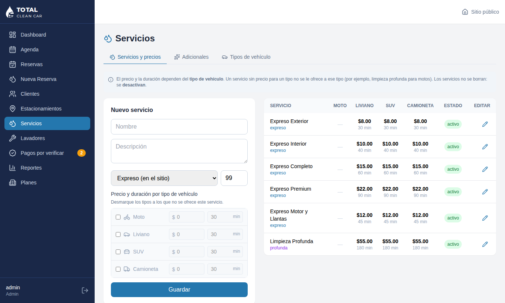

**Figura 13 — Servicios y precios.** A la izquierda el formulario, a la derecha la
tabla de precios por tipo de vehículo ("—" = no se ofrece).

La duración importa: define cuánto tiempo se bloquea en la agenda. Un cambio de
precio vale para las reservas nuevas; las ya hechas conservan su precio.

**Pendiente al 27/09/2026:** las motos todavía no tienen ningún precio cargado, así
que no pueden reservar hasta que se carguen.

### 7.2 Adicionales

En **Servicios → Adicionales** se crean los extras (nombre, precio y minutos
extra). Aparecen en el paso "¿Algo más?" de la reserva. Los planes de edificio no
los cubren.

### 7.3 Tipos de vehículo

En **Servicios → Tipos de vehículo** están moto, liviano, SUV y camioneta. Se
pueden crear otros (por ejemplo, van) y después asignarles precios en la primera
pestaña. Desactivar un tipo impide registrar vehículos nuevos de ese tipo y
reservar con los existentes.

### 7.4 Clientes

El operador registra clientes. Solo el administrador puede **crear el acceso** de
un cliente o **restablecer su contraseña**: el sistema genera una contraseña
temporal que se muestra una sola vez, para entregársela al cliente. Suspender a un
cliente le impide ingresar y reservar.

### 7.5 Lavadores

Cree cada lavador con **Nuevo lavador** y su **cuenta de acceso** para que vea Mis
Trabajos. La cantidad de lavadores activos es la capacidad de servicios expreso en
los sitios que no tienen una capacidad propia.

### 7.6 Estacionamientos

Cada sitio tiene dirección, horario de apertura y cierre, y en **Configurar agenda**:

- **Capacidad expreso:** lavados simultáneos en ese sitio (0 = la cantidad de lavadores activos).
- **Granularidad:** cada cuánto empiezan los horarios (60 minutos por defecto).

El **Mapa de plazas** registra los puestos y las bahías de lavado. Las bahías
disponibles son la capacidad de la limpieza profunda.

### 7.7 Planes para edificios

Un plan cubre una cantidad de lavados al mes para todos los residentes de un sitio.
Cree el plan (precio mensual, lavados incluidos, modalidad) y asígnelo al
estacionamiento. Mientras quede cupo, el servicio principal de cada reserva en ese
sitio sale en $0. El cupo se reinicia el día 1 de cada mes.

### 7.8 Reportes

Ingresos de los últimos 30 días, lavados por servicio y por sitio, y el detalle
lavado por lavado. Se exportan a **Excel** o **PDF**.

## 8. Preguntas frecuentes y problemas

| Situación | Qué hacer |
| --- | --- |
| Un servicio aparece "No disponible para moto" (u otro tipo) | Ese servicio no se ofrece para ese tipo de vehículo. Elija otro, o pida al administrador que le cargue un precio para ese tipo. |
| No puedo elegir mi vehículo | Le falta el tipo. Elija moto, liviano, SUV o camioneta en la misma tarjeta y queda habilitado. |
| No aparecen horarios para hoy | Ya pasaron o están agotados. Elija otro día en la tira de fechas. |
| Al confirmar dice "Franja no disponible" | Otra persona tomó el último cupo en ese instante. Vuelva al paso anterior y elija otra hora. |
| Me pide iniciar sesión otra vez | La sesión dura 24 horas. Ingrese de nuevo con su usuario y contraseña. |
| Olvidé mi contraseña | El administrador la restablece y le entrega una temporal. |
| Envié el comprobante y sigue "en verificación" | El operador todavía no lo revisó. Si lo rechaza, la reserva lo indica y puede enviar otro. |
| El comprobante no sube | Revise que sea un solo archivo, de menos de 5 MB, en imagen o PDF. |
| No me llegan los correos | Revise la carpeta de spam. Todo lo que dice el correo también está en Mis Reservas. |
| El lavador no puede tocar "Iniciar" | La reserva aún no está confirmada. El operador debe confirmarla primero. |
| No puedo cancelar | Una vez iniciado el lavado ya no se cancela desde la app. Comuníquese con la empresa. |
| La app no abre o dice "Error de conexión con el servidor" | Revise que el teléfono tenga internet (datos o wifi) y vuelva a intentar. Si sigue, avise al soporte. |
| La web muestra una versión vieja | Cierre la pestaña o la app instalada y vuelva a abrirla. |

Para cualquier otro problema, avise al operador o al administrador con el **código
de la reserva** (por ejemplo `RES-2026-00034`): con él encuentran todo el historial.

## 9. Mensajes del sistema

| Mensaje | Significa | Qué hacer |
| --- | --- | --- |
| Token inválido o expirado | La sesión caducó | Iniciar sesión de nuevo |
| La cuenta está suspendida | Un administrador la desactivó | Pedir la reactivación |
| Acceso denegado | La opción no corresponde a su rol | Pedir el permiso a un administrador |
| Demasiados intentos / Demasiadas solicitudes | Límite de seguridad alcanzado | Esperar unos minutos |
| Ese horario ya pasó. Elija uno más tarde. | La hora elegida ya empezó | Elegir otra hora |
| El servicio dura N min y no cabe en el horario de atención | Con los adicionales, el servicio termina después del cierre | Elegir una hora más temprana o quitar adicionales |
| "…" no está disponible para este tipo de vehículo | El servicio no se ofrece a ese tipo | Elegir otro servicio |
| El vehículo no tiene tipo registrado | Vehículo anterior al catálogo de tipos | Elegir su tipo en la tarjeta del vehículo |
| Esta reserva no tiene saldo pendiente | Ya está pagada | No hace falta pagar |

---

*Capturas tomadas el 2026-09-27 de la versión en producción y del entorno de
prueba, solo con datos de demostración.*
