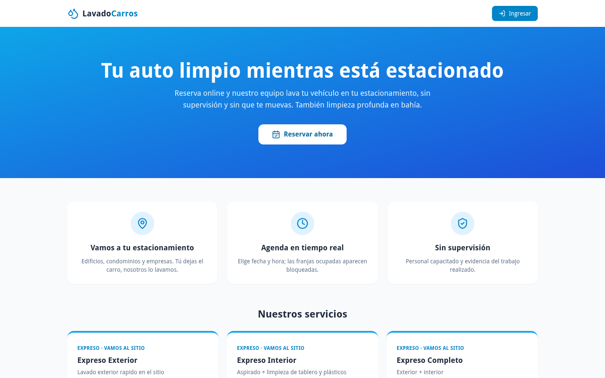
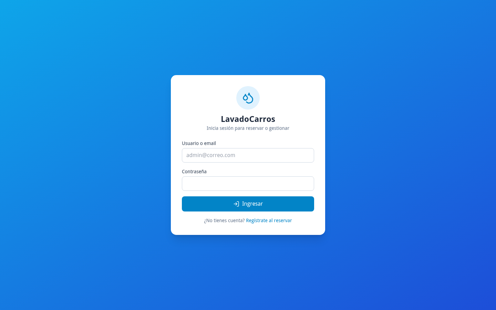
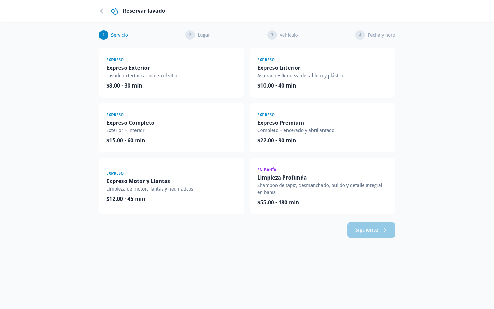

# Manual de usuario — LavadoCarros

Version 1.0 · 2026-09-15

## 1. Introduccion

**LavadoCarros** permite reservar el lavado de tu vehiculo **sin moverlo**: el
equipo va al estacionamiento donde lo dejas y lo lava ahi.

## 2. Objetivo

Reservar, seguir y pagar el servicio desde el navegador, y dejar constancia del
trabajo hecho con evidencia fotografica.

## 3. Requisitos

- Navegador moderno.
- Estar en la red donde esta publicado el sistema.
- Para reservar: una cuenta. Se crea en el momento de la primera reserva.

## 4. Acceso

    http://192.168.3.124:3041

## 5. Portada publica

**Figura 1 — Portada publica.** Presenta el servicio, sus tres ventajas y el
catalogo. El boton **Reservar ahora** inicia el proceso; **Ingresar**, arriba a
la derecha, lleva al inicio de sesion.

Los tres servicios del catalogo son:

| Servicio | Que incluye |
|---|---|
| **Expreso Exterior** | lavado exterior rapido en el sitio |
| **Expreso Interior** | aspirado, limpieza de tablero y plasticos |
| **Expreso Completo** | exterior + interior |

## 6. Inicio de sesion

**Figura 2 — Pantalla de inicio de sesion.** Acepta **usuario o correo** y
contrasena. Quien no tenga cuenta usa *"Registrate al reservar"*.

> Si aparece **"La cuenta esta suspendida"**, no es un error de contrasena: un
> administrador desactivo la cuenta. Hay que pedir su reactivacion.

> Si aparece **"Demasiados intentos"**, el sistema bloqueo temporalmente por
> seguridad tras varios intentos fallidos. Esperar unos minutos.

## 7. Reservar un lavado

**Figura 3 — Pantalla de reserva.**

1. Elegir el **estacionamiento**.
2. Elegir el **vehiculo** (o darlo de alta).
3. Elegir el **tipo de servicio**.
4. Elegir **fecha y hora**. Las franjas ya ocupadas aparecen bloqueadas: el
   sistema consulta la disponibilidad real.
5. Confirmar.

La reserva queda registrada y un operador asigna al lavador.

## 8. Seguimiento

En **Mis reservas** se ve el estado de cada una. Cada cambio de estado queda
guardado en el historial del sistema.

Cuando el lavador termina, **sube fotos del trabajo**. Quedan asociadas a la
reserva como constancia.

## 9. Pagar

Dos formas:

**a) Subir comprobante.** Se adjunta la transferencia o deposito. Acepta
imagen (JPG, PNG, WEBP, GIF) o **PDF**, hasta **5 MB**, un archivo. Queda en
estado *por validar* hasta que el operador lo revise.

**b) Tarjeta.** El sistema genera el cobro.

> **Importante:** al momento de esta auditoria la **pasarela de tarjeta no esta
> conectada todavia**. El propio sistema responde que el pago *"queda pendiente
> hasta integrar la pasarela"*. Para pagos efectivos, usar el comprobante.

## 10. Calificar

Terminado el servicio se puede calificar. Es opcional.

## 11. Mensajes del sistema

| Mensaje | Significa | Que hacer |
|---|---|---|
| Token no proporcionado / Token invalido o expirado | la sesion caduco | volver a iniciar sesion |
| La cuenta esta suspendida | un administrador la desactivo | pedir reactivacion |
| Acceso denegado. Se requiere rol: X | la opcion no corresponde a tu perfil | pedir el permiso a un administrador |
| Demasiados intentos / Demasiadas solicitudes | limite de seguridad alcanzado | esperar unos minutos |
| No se puede pagar una reserva "cancelada" | la reserva ya no esta activa | crear una reserva nueva |
| Esta reserva no tiene saldo pendiente | ya esta pagada | no hace falta pagar |
| Reserva no encontrada | fue eliminada o el enlace es viejo | recargar **Mis reservas** |

## 12. Errores comunes

**No encuentro franjas libres.** Las ocupadas se bloquean automaticamente.
Probar otra fecha u otro estacionamiento.

**El comprobante no sube.** Revisar que pese menos de 5 MB y sea imagen o PDF.
Otros formatos se rechazan.

**Subi el comprobante y sigue pendiente.** Es normal: requiere validacion
manual de un operador.

**No me llego el recordatorio.** Los avisos salen por correo y WhatsApp.
Verificar que los datos de contacto esten bien en el perfil.

## 13. Preguntas frecuentes

**¿Tengo que estar presente durante el lavado?**
No. Ese es el proposito: *"Sin supervision. Personal capacitado y evidencia del
trabajo realizado"*.

**¿Como se que lo lavaron?**
El lavador sube fotos del trabajo, que quedan en la reserva.

**¿Hay app para el celular?**
No. Se usa desde el navegador del celular.

**¿Puedo cancelar?**
Los estados `cancelada` y `no_asistio` existen en el sistema. El procedimiento
exacto para el cliente: `NO DETERMINADO` — confirmar con el operador.

**¿Que es una suscripcion?**
Existe un modelo de planes y suscripciones por estacionamiento. Al momento de
la auditoria hay 1 plan y 1 suscripcion cargados. Las condiciones comerciales:
`NO DETERMINADO`.
